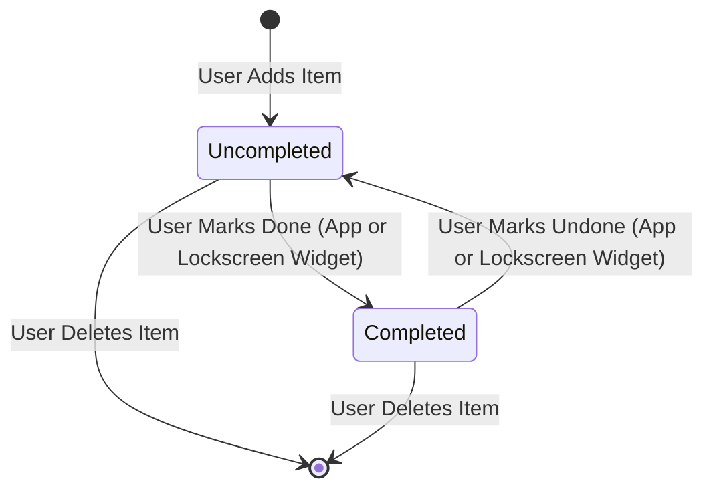

# Data Model Design: Shopping List MVP

This document outlines the data model and storage structures for the Shopping List application.

## Entity: `ShoppingItem`

The primary entity managed by the system. Every item in the shopping checklist is represented by this structure.

### Fields and Schema

| Field Name | Data Type | Constraints | Description |
|------------|-----------|-------------|-------------|
| `id` | String (UUID) | Primary Key, Not Null, Unique | Globally unique identifier generated upon creation. |
| `name` | String | Not Null, Length: 1-100 characters | Name of the item (e.g., "Bananas"). Leading/trailing whitespace is trimmed. |
| `isCompleted` | Boolean | Not Null, Default: `false` | Status indicating whether the item has been found/checked off. |
| `createdAt` | Integer (Epoch MS) | Not Null | Timestamp when the item was added, used for stable list sorting (oldest first). |

### Validation Rules
- **Non-Empty Name**: The `name` field must not be empty or contain only whitespace. The app UI must reject blank submissions.
- **Max Length**: The `name` is limited to 100 characters to prevent database bloating and UI clipping.

---

## State Transition Model

The lifecycle of a shopping item consists of simple transitions:



---

## Database Implementation (Local Storage)

### SQLite Schema (`shopping_items` table)
Although abstract from presentation, the local storage layer in `shared_core` creates this table structure:

```sql
CREATE TABLE IF NOT EXISTS shopping_items (
    id TEXT PRIMARY KEY NOT NULL,
    name TEXT NOT NULL,
    is_completed INTEGER NOT NULL DEFAULT 0,
    created_at INTEGER NOT NULL
);
```

### Shared Storage Mapping (home_widget)
To expose this list to the Lockscreen Widgets:

- **iOS App Group Container**: The app writes the current checklist as a serialized JSON string in a shared `UserDefaults` key (e.g. `group.com.bluecollarcode.shopping.list`).
- **Android SharedPreferences Pool**: The app writes the same serialized JSON string in SharedPreferences accessible by the AppWidgetProvider.

**JSON Schema for Shared Pool**:
```json
[
  {
    "id": "f81d4fae-7dec-11d0-a765-00a0c91e6bf6",
    "name": "Apples",
    "isCompleted": false,
    "createdAt": 1780000000000
  }
]
```
